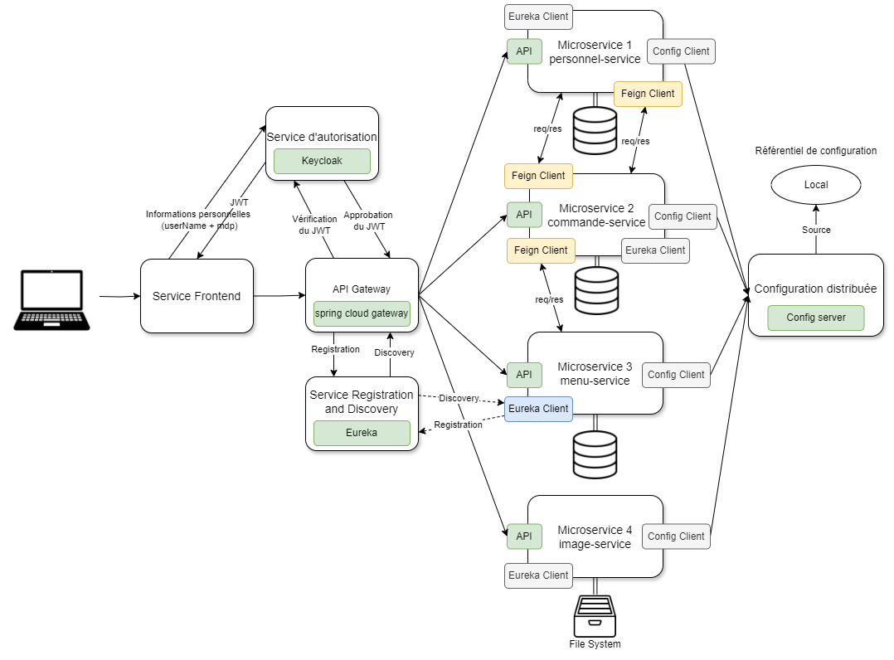
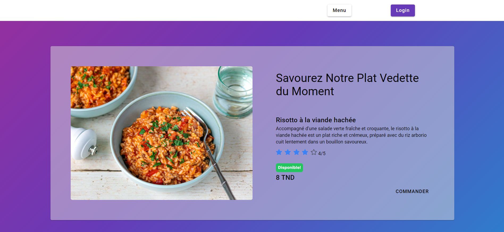

# OfficeEats - Web Application
## Overview
This is a web application project developed during a summer internship. The application enables employees of a company to place meal orders within the company's cafeteria. The project was implemented using Spring Boot for the backend and Angular for the frontend.
## Features
- Microservice Architecture:

  The application is designed with a microservice architecture to ensure modularity and scalability.
- API Gateway:

  An API gateway is used to manage and route requests to the appropriate microservices.
- Service Registration and Discovery:

  **Eureka** is employed for service registration and discovery, enabling dynamic service management.
- Authorization Server:

  Security is managed using **Keycloak** for robust authentication and authorization.
- Configuration Server:

  A config server is utilized for centralized management of application configurations.
- Responsive Web Design:

  The frontend is designed to be responsive.
## Built with
- Frontend:
  
  [![Angular][Angular.io]][Angular-url]
- Backend:
  
  [![SpringBoot][SpringBoot.io]][SpringBoot-url]
- Security:
  
  [![Keycloak][Keycloak.io]][Keycloak-url]
## Architecture

## Preview
Below is the homepage that will be displayed when accessing the web application.

<!-- https://www.markdownguide.org/basic-syntax/#reference-style-links -->
[Angular.io]: https://img.shields.io/badge/Angular-DD0031?style=for-the-badge&logo=angular&logoColor=white
[Angular-url]: https://angular.io/
[SpringBoot.io]: https://img.shields.io/badge/Spring%20Boot-FFFFFF?style=for-the-badge&logo=springboot&logoColor=6DB33F&labelColor=FFFFFf&color=6DB33F
[SpringBoot-url]: https://spring.io/projects/spring-boot
[Keycloak.io]: https://img.shields.io/badge/Keycloak-FFFFFF?style=for-the-badge&logo=keycloak&logoColor=08B6E0
[Keycloak-url]: https://www.keycloak.org/
